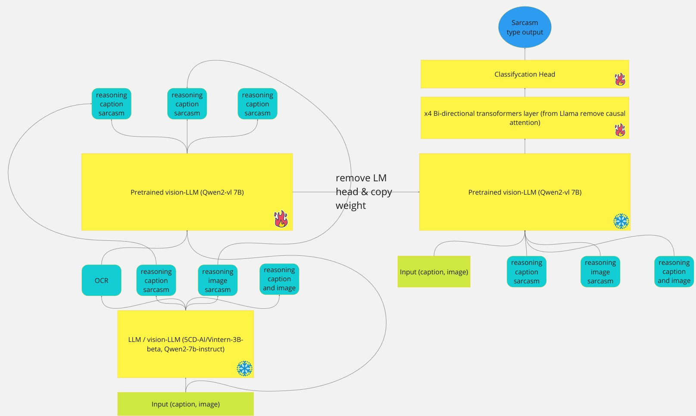
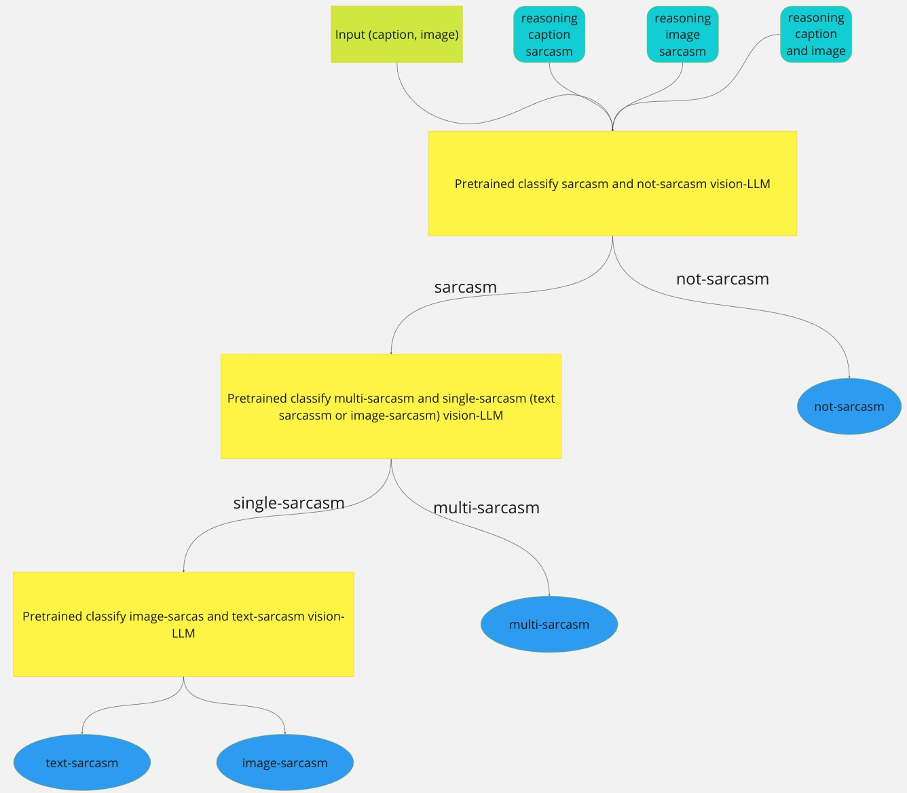

# Pipeline classification model

# Pipeline hirarchitecture prediction


# Install dataset follow these structure
```
data
├── private_test
│   ├── image_reasoning.json
│   ├── ocr_llm.json
│   ├── processed_data.json
│   ├── reasoning.json
│   ├── test-images
│   ├── text_reasoning.json
│   └── vimmsd-private-test.json
└── public_train
    ├── image_text_reasoning
    │    ├── image_text_ocr_llm_reasoning_v2.json
    │    ├── reasoning_vi_intern_image_reasoning.json
    │    ├── test_image_text_ocr_llm_reasoning_v2.json
    │    ├── text_reasoning.json
    │    ├── reasoning.json
    │    ├── train_image_text_ocr_llm_reasoning_v2.json
    │    ├── train_image_umsaple_x6_image_text_ocr_llm_reasoning_v2.json
    │    └── train_text_umsaple_x10_image_text_ocr_llm_reasoning_v2.json
    ├── train-images
    └── vimmsd-train.json
```
# Requirements
* All the experiments is done on 2 rtx 3090 GPU if you used different setup you need to change some config in the `scripts` folder
* install CUDA 12.4 version and Driver Version: 550.120 (installation guild https://www.cherryservers.com/blog/install-cuda-ubuntu)
* install anaconda or miniconda
* install python 3.10
* using ubuntu 24.04 noble version

# Set up and install environment
```bash
conda env create -f environment.yml
```

# Install LlaMA-factory
```bash
python -m venv .venv
source .venv/bin/activate
git clone --depth 1 https://github.com/hiyouga/LLaMA-Factory.git
cd LLaMA-Factory
pip install -e ".[torch,metrics]"
```

# Preprocess data
```bash
# prepare test reasoning, ocr, image reasoning and reasoning
bash script/preprocess_ds.sh
```

# Training
Training pre-trained vision-LLM model using LLaMA-Factory
```bash
cd LLaMA-Factory
source .venv/bin/activate
bash config_train/train_qwen2_draft_reasoning.sh
bash LLaMA-Factory/config_train/merge.sh
cd ..
```

Training sarcasm detection model using custom model call MSD you can change the model config in script/hierarchical_script/cls_image_text.yaml, script/hierarchical_script/cls_mul_vs_img_text.yaml and script/hierarchical_script/cls_not_yet_sarcasm.yaml
```bash
bash script/hierarchical_script/sequency_train.sh
```

# Download pretrained model
```bash
# download classify between image and text sarcasm
huggingface-cli download nguyen-brat/classify-image-text-sarcasm
# donwload classify between sarcasm and not-sarcasm
huggingface-cli download nguyen-brat/classify-sarcasm_and_not_sarcasm
# download classify between multi-sarcasm and single sarcasm (image-sarcasm or text-sarcasm)
huggingface-cli download nguyen-brat/classify-multi-sarcasm_and_single_sarcasm
```

# Inference
change the folder path depend on your model path
```bash
python hierarchiecal_run.py --model_path_not_multi "model/hierarchical/cls_multi_not_sarcasm/merged_model" --model_path_multi_image_text "model/hierarchical/cls_multi_sarcasm_vs_image_text_sarcasm/merged_model" --model_path_image_text "model/hierarchical/cls_image_vs_text_sarcasm_draft_image_text_reasoning_v2/merged_model" --batch_size 1 --annotation_path "data/private_test/processed_data.json" --output_dir "submit/private/results_hirachitecture_best_merge_v2_text_image_cls.json" --phase "test"
```